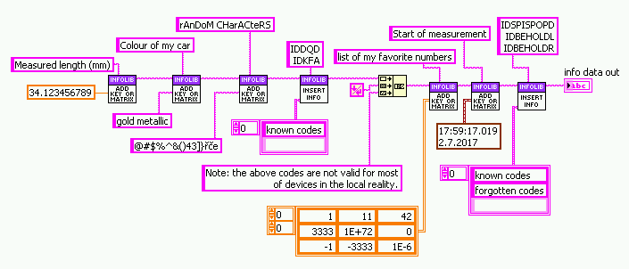
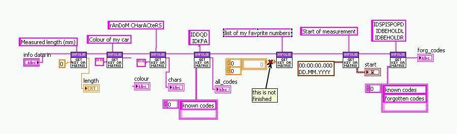

# Info strings

A human-readable brain-dead simple data format with saving and loading scripts and VIs.

This data format aims for:
1. human readability;
1. easy manual editing;
1. easy manual creating;
1. easy storage of text data, numeric data and matrices.
1. use standards: RFC 4180 for matrices (CSV) and ISO 8601 for time stamps.

## Example of info string

    Measured length (mm):: 34.123456789
    Colour of my car:: gold metallic
    rAnDoM CHarACteRS:: @#$%^&()43]}řčě
    #startsection:: known codes
            IDDQD
            IDKFA
            #startsection:: forgotten codes
                    IDSPISPOPD
                    IDBEHOLDL
                    IDBEHOLDR
            #endsection:: forgotten codes
    #endsection:: known codes
    Note: the above codes are not valid for most 
    of devices in the local reality.
    #startmatrix:: list of my favorite numbers
                1; 11; 42
                3333 ;1E72; 0
                -1; -3333 ; 0.000001
    #endmatrix:: list of my favorite numbers
    Start of measurement:: 2017-07-02T17:59:17.019788

The example can be produced by following code in GNU Octave/Matlab (can differ because of rounding error):

    is = infosetnumber('Measured length (mm)', 34.123456789);
    is = infosettext(is, 'Colour of my car', 'gold metallic');
    is = infosettext(is, 'rAnDoM CHarACteRS', '@#$%^&()43]}řčě');
    is = infosetsection(is, 'known codes', sprintf('IDDQD\nIDKFA'));
    is = [is sprintf('\nNote: the above codes are not valid for most\nof devices in the local reality.')];
    is = infosetmatrix(is, 'list of my favorite numbers', [1  11  42; 3333 1E72 0; -1  -3333 0.000001]);
    is = infosettime(is, 'Start of measurement', time());
    is = infosetsection(is, 'forgotten codes', sprintf('IDSPISPOPD\nIDBEHOLDL\nIDBEHOLDR'), {'known codes'});

The example can be produced by following LabVIEW code:

One can read data in the example using following script in GNU Octave/Matlab

    length     = infogetnumber(is, 'Measured length (mm)')
    colour     = infogettext(is, 'Colour of my car')
    chars      = infogettext(is, 'rAnDoM CHarACteRS')
    all_codes  = infogetsection(is, 'known codes')
    nums       = infogetmatrix(is, 'list of my favorite numbers')
    start      = infogettime(is, 'Start of measurement')
    forg_codes = infogetsection(is, 'forgotten codes', {'known codes'})

One can read data in the example using following LabVIEW code:

## Format description
Format consists of system of keys and values separated by double colon.

    some key :: some value
    other key :: other value
    A:: 1
    B([V?*.])::    !$^&*()[];::,.

Keys can contain any character but newline (and probably shouldn't contain double colon).
Space characters can be before key, after key, before or after delimiter (::) or after key.
Value can be anything but newline.

Any text can be inserted in between lines.

    some key :: some value
    something totally 
    not related 
    to anything
    other key :: other value

Matrices are stored as semicolon delimited values. Space characters before or after number or semicolon are not
important. Matrices starts by keyword `#startmatrix:: NameOfMatrix` and ends by keyword `#endmatrix:: NameOfMatrix`.

    #startmatrix:: simple matrix 
    1;  2; 3
    4;5;         6
    #endmatrix:: simple matrix

Matrices can also contain e.g. strings. RFC 4180 (CSV format) is used to store string matrix, thus
any character can be saved.

    #startmatrix:: string matrix 
    a;     "b""b"
    "c;c"; "d"
    #endmatrix:: string matrix

Sections are used for multiple keys with same values or multiline content. Sections starts by keyword 
`#startsection:: NameOfSection` and ends by keyword `#endsection:: NameOfSection`.

    #startsection:: section 1 
        C:: c in section 1 
        #startsection:: subsection
            C:: c in subsection
        #endsection:: subsection
    #endsection:: section 1
    #startsection:: section 2
        C:: c in section 2
    #endsection:: section 2
    #startsection:: multiline content
        abcdefgh
        ijklmnopqrstuv
        wxyz
    #endsection:: multiline content

Number precision is determined by the programming language. The aim of scripts and VIs is to keep
at least 12 digits of precision (can be needed for some scientific calculations, some times even
more is required).

The time is saved by scripts and VIs according ISO 8601 format, i.e.:

    yyyy-mm-ddThh-mm-ss.ssssss

## GNU Octave scripts
Scripts for saving and loading:
1. text data -- `infosettext.m`, `infogettext.m`;
1. text data as matrices -- `infosettextmatrix.m`, `infogettextmatrix.m`;
1. scalar numeric data -- `infosetnumber.m`, `infogetnumber.m`;
1. vector and matrix numeric data -- `infosetmatrix.m`, `infogetmatrix.m`;
1. time data -- `infosettime.m`, `infogettime.m`;
1. time data as matrices -- `infosettimematrix.m`, `infogettimematrix.m`;
1. sections -- `infosetsection.m`, `infogetsection.m`.

All scripts contains also:
1. help in texinfo format;
1. examples in help;
1. tests;

Number of files was kept to minimum, no auxiliary functions are needed, recursion is used a lot.
Core functions are `info(g/s)etsection.m` and `info(g/s)ettext.m`. Other are derived from these four.

## GNU Octave package

## Matlab scripts
I try to keep Matlab compatibility, however it irritates me quite a lot, because Matlab language is
inferior to GNU Octave possibilities.

Scripts for Matlab are generated from GNU Octave scripts using _octave2matlab_ by _thierr26_.
See [octave2matlab github webpage](https://github.com/thierr26/octave2matlab "octave2matlab"). 
Run script `convert_scripts_octave_to_matlab` to convert Matlab scripts from GNU Octave scripts. New
files are in `Matlab_scripts/after_conversion/`. Check them and copy to `Matlab_scripts/`.

## LabVIEW VIs

Main VIs are `Add Key or Table.vi` and `Get Key or Table.vi`. VIs are polymorphic, so they adapt to
the input. VI `Insert Info Data.vi` is used to insert new info strings at desired section of
existing info string. `Load Info.vi` and `Save Info.vi` loads and saves from a file.

Reading matrices is not yet finished.

## Why yet another data format?
There are other data serialization formats. However these formats were usually developed by
programmers. Arrays are not the most typical thing to write down into human readable format. However
during measurements I needed to store matrices with few elements as well as large series of measured
data. And I also needs some description for values, from time to time to add notes and sometimes modify
it manually. Follows basic list of existing formats and reasons why I do not use it for measurement data.

(Maybe there is some ideal data format but I couldn't find it.)

### XML
Format appears to be human readable but really it is too cluttered. And try to write down a matrix
in this format. See a simple vector stored in XML:

    <Matrix>
        <Element>-0.281325798</Element>
        <Element>0.0291150014</Element>
        <Element>0.00121234399</Element>
        <Element>-0.000140823665</Element>
        <Element>0.154861424</Element>
    </Matrix>

### JSON
It is definitely _not_ a human readable format. And I could never get the brackets right when editing:

    {"menu": {
      "id": "file",
      "value": "File",
      "popup": {
        "menuitem": [
          {"value": "New", "onclick": "CreateNewDoc()"},
          {"value": "Open", "onclick": "OpenDoc()"},
          {"value": "Close", "onclick": "CloseDoc()"}
        ]
      }
    }}

### INI
Nice and human readable, but vectors or matrices are not implemented by any library.

### YAML
Generally nice and human readable format but matrices are not easily readable and editable:

    -
      - 1
      - 2
    -
      - 3
      - 4

### TOML
Similar to INI, however matrices are not easily readable and editable:

    matrix = [ [1, 2], [3, 4] ]

### GNU Octave text format
GNU Octave use simple and powerful format for data saving, the problem is it requires a header hard
to write manually. See example of a matrix:

    # Created by Octave 3.8.1, Thu Jun 29 21:13:18 2017 CEST <some_user@some_server>
    # name: a
    # type: matrix
    # rows: 2
    # columns: 2
     1 2
     3 4

# How to compile/build:
## GNU Octave scripts:
1. Run `make` in `GNU_Octave_scripts/source` directory:
    make

## Matlab scripts:
1. Build GNU Octave scripts first
2. Convert GNU Octave scripts to MATLAB using [octave2matlab](https://github.com/thierr26/octave2matlab). Run:
    convert_scripts_octave_to_matlab
3. Copy files from directory `Matlab_scripts/after_conversion/` to `Matlab_scripts`

## LabVIEW:

# Self-testing
1. All script got `test script` capability. E.g. `test infosetnumber`. One can self-test all scripts
   at once by using:

        octave _selftest_scripts_octave.m
    This does not work in Matlab.
1. Do thorough test by running:

        infolib_test.m
    in both GNU Octave and Matlab
1. LabVIEW got a thorough test by using

        LabVIEW_VIs/Private/Testing/Complex Test.vi

# Known issues
## GNU Octave
1. (minor) Test No 50 of `infolib_test.m` is bad during parsing and writing. Parsing got issues reading some
   special characters, writing creates too large indentation.

## Matlab
1. All UTF8 tests are disabled, Matlab cannot work with UTF8 properly.

## LabVIEW
15, 16, 27, 47, 48: LV cannot handle UTF8 characters
43: (minor) fails if tests 47 and 48 are present in tmp.info, otherwise is ok.
30: (minor) rounding error on 17th significant place
34: LV cannot handle proper csv: cell "X;X" is considered as two cells because LV do not know apostroph enclosing
36: (minor) rounding error on 7th decimal place of time stamp
